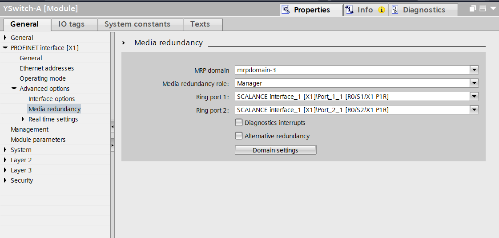
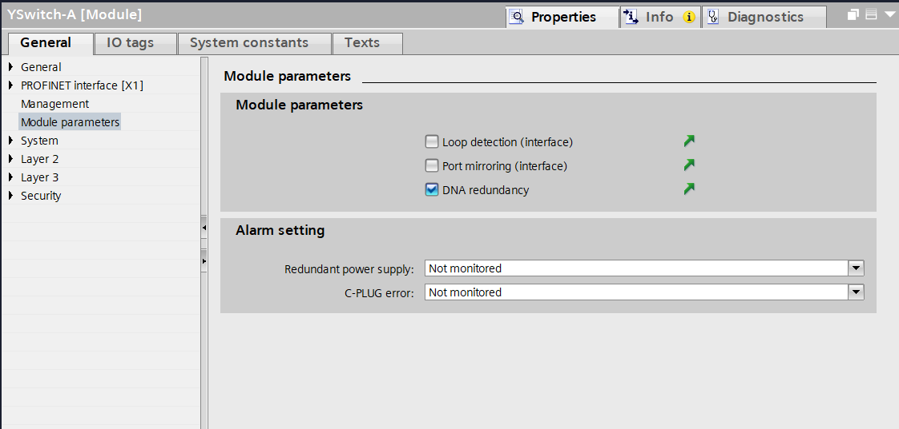
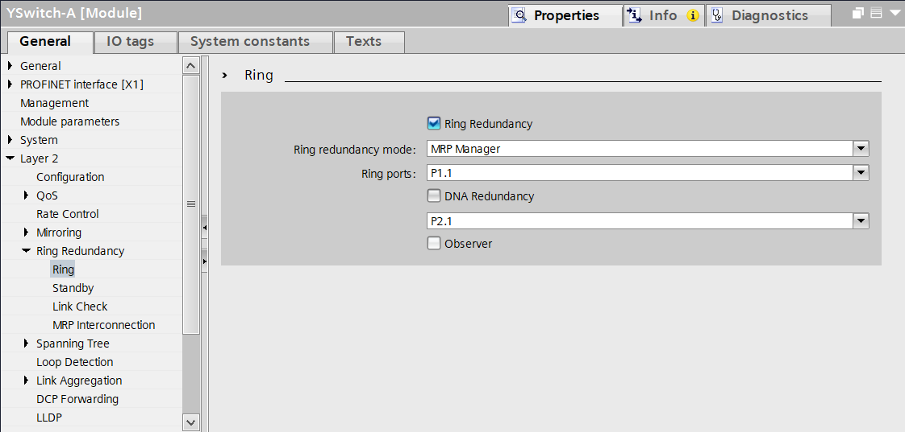
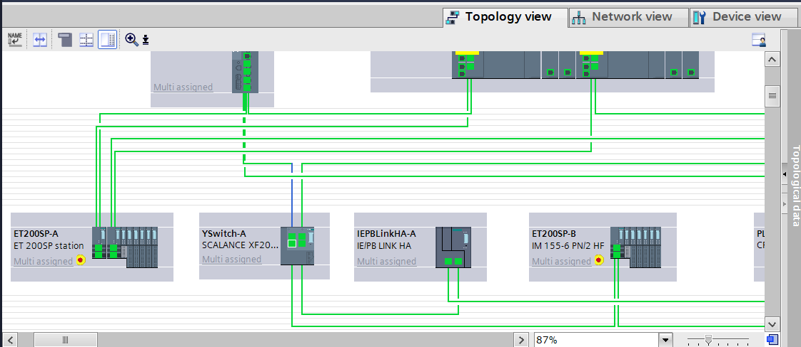
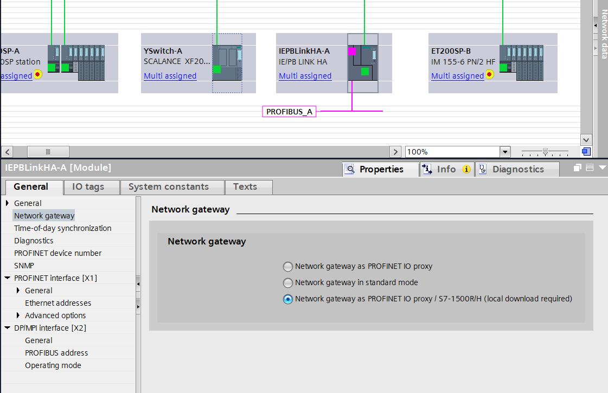
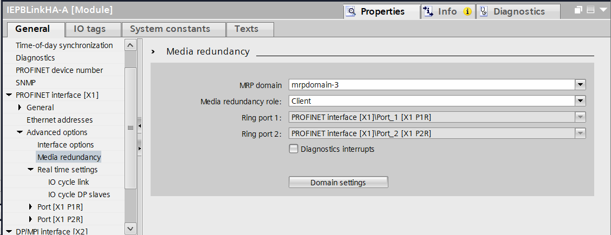

## Module 2: Setting up the Sub-ordinate System (S2 & Y-Switch)

### 2.1 Learning Objectives
*   **Bridge** the highly available R1 Backbone to a single-interface S2 subordinate "Blue Ring".
*   **Select** compatible hardware components and configure the network topology.
*   **Commission** the Y-Switch (XF204-DNA) using precise TIA Portal parameterization to manage MRP Domain 3.
*   **Achieve** a seamless 'RUN-Redundant' pairing between primary and backup S7-1500RH CPUs.
*   **Diagnose** common integration faults within redundant PROFINET networks.

### 2.2 Hardware Requirements
Building a reliable S2 subordinate system off an R1 backbone requires strict adherence to compatible hardware selections.

1.  **Redundant Controllers:** Utilizing the S7-1518HF-4 PN (or compatible 1517H-3 PN) high-availability CPUs.
2.  **Synchronization Link:** High-quality fiber-optic interconnects linking the primary and backup CPUs via dedicated sync modules, ensuring real-time project state synchronization.
3.  **The Y-Switch:** The SCALANCE XF204-DNA must be used. Standard managed switches cannot perform the DNA packet duplication/deduplication required for S2 integration.
4.  **S2 Capable IO Devices:** Subordinate devices like the ET200SP-B interface module and the PN/PN Coupler must explicitly support System Redundancy (S2) profiles.

### 2.3 Network Topology
The subordinate architecture relies on an isolated ring network securely bridged to the main backbone.

1.  **Split Backbone Isolation:** The main architecture utilizes `mrpdomain-1` (Side A) and `mrpdomain-2` (Side B). The Y-Switch uplinks physically connect to these separate rings but do not logically join those domains.
2.  **The Blue Ring (Subordinate Ring):** The Y-Switch forms a completely independent ring loop (`mrpdomain-3`) acting as the bridge for all single-interface S2 devices.
3.  **Manager/Client Roles:** The Y-Switch assumes the critical role of MRP Manager for Domain 3, overseeing client devices like the `IEPBLinkHA-A`, `ET200SP-B`, and `PNPNCoupler-B`.

>   **Pro-Tip:** Physical network segregation is key. Never cross-connect an S2 subordinate ring directly into an R1 backbone domain. This misconfiguration introduces unacceptable latency and breaks the redundancy mechanism.

### 2.4 Software Configuration: The Y-Switch (XF204-DNA) Setup
The Y-Switch requires meticulous parameterization within TIA Portal. Follow these exact steps to ensure a stable integration.

**1. Physical Uplinks (Standard Ethernet)**
Configure the physical connections bridging to the primary controllers.
*   **Port 1:** Connect to the Side A backbone (`Switch-A`).
*   **Port 2:** Connect to the Side B backbone (`Switch-B`).
>   **Pro-Tip:** Ensure these ports are configured strictly as standard PROFINET uplinks. They must **NOT** be assigned as ring ports for `mrpdomain-1` or `mrpdomain-2`.

**2. Assigning the Role of Y-Switch as Manager (MRP Domain 3)**
The Y-Switch must manage the subordinate S2 ring traffic.

1.  Navigate to the Y-Switch's properties in TIA Portal: `PROFINET interface [X1] -> Advanced options -> Media redundancy`.
2.  **MRP Domain:** Set this strictly to `mrpdomain-3` to isolate the S2 ring traffic from the primary controllers.
3.  **Media Redundancy Role:** Select `Manager` from the dropdown list.
4.  **Ring Port Assignments:** Ensure the correct physical ports on the switch modules are selected.
    *   **Ring port 1:** Set to `SCALANCE interface_1 [X1]\Port_1_1 [R0/S1/X1 P1R]`.
    *   **Ring port 2:** Set to `SCALANCE interface_1 [X1]\Port_2_1 [R0/S2/X1 P1R]`.

**3. Module Parameters: Enabling DNA Redundancy**
Activate the core Dual Network Access routing functionality.

1.  Navigate in the Y-Switch properties to `PROFINET interface [X1] -> Module parameters`.
2.  Locate the **Module parameters** block.
3.  Check the box for **DNA redundancy**.

>   **Pro-Tip:** Without this checked, the switch will not duplicate/deduplicate packets across the R1 backbone, breaking S2 integration.

**4. Layer 2 Ring Redundancy Settings**
Configure the specific Layer 2 behavior for the managed ring.

1.  From the Module parameters view, click the green arrow next to the "DNA redundancy" checkbox to navigate directly to the specific module settings. Alternatively, locate the module in the device view and open its properties: `Layer 2 -> Ring Redundancy -> Ring`.
2.  Check the **Ring Redundancy** box to enable layer 2 loop management.
3.  Set the **Ring redundancy mode** to `MRP Manager`.
4.  Define the **Ring ports** utilizing the dropdown menus: Select `P1.1` and `P2.1` to correspond with the physical S2 ring connections.

**5. Topology View Configuration**
Accurately mapping the physical cable connections within TIA Portal is essential for network diagnostics and topology-based PROFINET device replacement.

1.  Navigate to the **Topology view** tab in the *Devices & networks* workspace.
2.  Locate the Y-Switch module (`YSwitch-A`).
3.  Click and drag to create the green graphical connections representing the physical PROFINET cables.
4.  **Uplinks (Blue Cables in Diagram):** Ensure the cables from `Switch-A` and `Switch-B` are "landed" on the specific ports configured as standard uplinks (e.g., `X1 P1` and `X1 P2` on the base module).
5.  **Subordinate Ring (Red Cables in Diagram):** Ensure the cables forming the Blue Ring are landed directly on the designated MRP Ring Ports defined in the previous step (e.g., ports `P1.1` and `P2.1` on the specific switch module).

>   **Pro-Tip:** The Topology view must perfectly mirror reality. If a cable is plugged into physical port `P1.1` but drawn to port `P1.2` in TIA Portal, you will encounter persistent topology errors during hardware compilation and download.

**6. Device Commissioning and Hardware Download**
Before the final hardware configuration can be downloaded, the physical Y-Switch must be commissioned and its default security credentials updated, mirroring the procedure utilized for the primary backbone switches.

1.  **Assign PROFINET Name and IP:**
    *   Navigate to **Online access** in the project tree, select your network adapter, and click **Update accessible devices**.
    *   Locate the unconfigured XF204-DNA switch, expand it, and double-click **Online & diagnostics**.
    *   Under **Functions -> Assign PROFINET name**, assign the exact name configured in your project (e.g., `YSwitch-A`).
    *   Under **Functions -> Assign IP address**, assign the configured IP address.
2.  **Change Default Credentials (WBM):**
    *   Access the switch's Web Based Management (WBM) using a browser pointed to the newly assigned IP address.
    *   Log in using the factory default credentials (Username: `admin`, Password: `admin`).
    *   When prompted, strictly adhere to the project security standard by updating the credentials to:
        *   **Username:** `SiemensAdmin`
        *   **Password:** `Siemens1!`
3.  **Update TIA Portal User Management:**
    *   Return to the Y-Switch properties in TIA Portal.
    *   Navigate to `Security -> Users` and update the project configuration to match these new credentials, ensuring TIA Portal can authenticate automatically during the download process.
4.  **Download to Device:**
    *   Select the Y-Switch module (`YSwitch-A`) in the Device view.
    *   Click **Download to device** -> **Hardware configuration** to finalize the integration.

### 2.5 Software Configuration: The IE PB Link HA - A Setup
Progressing further into the S2 MRP chain hosted by the Y-Switch, the `IEPBLinkHA-A` must be configured to bridge the PROFINET ring to downstream PROFIBUS DP networks.

**1. Network Assignment and Topology**
Ensure the module is logically placed and assigned to the correct networks.
*   **PROFINET Network:** Ensure the device is connected to the subordinate "Blue Ring" managed by the Y-Switch (`mrpdomain-3`).
*   **PROFIBUS Network:** In the Network view, ensure the DP interface (`X2`) is assigned to the correct PROFIBUS subnet (e.g., `PROFIBUS_A`).

**2. Network Gateway Parameterization**
The gateway mode must be explicitly set to support the S7-1500R/H redundant architecture.
1.  Navigate to the properties of the IE/PB Link HA module: `General -> Network gateway`.
2.  Select the specific operating mode: **Network gateway as PROFINET IO proxy / S7-1500R/H (local download required)**.

>   **Pro-Tip:** The designation "(local download required)" is critical. It signifies that configuring this gateway parameter requires an independent, direct hardware download to the IE/PB Link HA itself, not just a system-wide download from the PLC.

**3. Media Redundancy (MRP) Role Configuration**
The IE/PB Link HA must be configured as a client within the subordinate ring.
1.  Navigate to the PROFINET interface properties of the module: `PROFINET interface [X1] -> Advanced options -> Media redundancy`.
2.  **MRP domain:** Set this explicitly to `mrpdomain-3` to align with the Y-Switch.
3.  **Media redundancy role:** Select **Client** from the dropdown list.
4.  Confirm the proper Ring port 1 and Ring port 2 assignments reflect physical connections.

**4. Commissioning: Device Naming and IP Assignment**
Just like standard PROFINET devices, the IE/PB Link HA requires proper identification on the network before it can communicate with the controllers.
1.  Navigate to **Online access** in the project tree, select your network adapter, and click **Update accessible devices**.
2.  Locate the unconfigured IE/PB Link HA, expand it, and double-click **Online & diagnostics**.
3.  Under **Functions -> Assign PROFINET name**, assign the exact device name configured in your TIA Portal project (e.g., `IEPBLinkHA-A`).
4.  Under **Functions -> Assign IP address**, assign the configured IP address matching the 192.168.0.x schema.

**5. Local Hardware Download**
Because of the specific gateway mode selected, perform a dedicated hardware download.
1.  Select the IE/PB Link HA module (`IEPBLinkHA-A`) in the Device or Network view.
2.  Click **Download to device** -> **Hardware configuration**.

### 2.6 Critical Configuration: Watchdog Tuning (S2 Devices)
S2 devices connected via the Y-Switch must survive the primary-to-backup switchover latency (approx 300ms) without generating a communication fault.

*   **Requirement:** The Watchdog Timer must exceed > 300ms.
*   **Action:**
    1.  Go to the device's properties (e.g., ET200SP-B): `PROFINET Interface -> Advanced Options -> Real time settings`.
    2.  Set a stable **Update Time** (e.g., 2.0ms, 4.0ms).
    3.  Adjust the **Accepted update cycles without IO data** manually.
    *   *Calculation:* `Update Time * Cycles > 300ms`. (e.g., 4ms update time * 100 cycles = 400ms watchdog).
>   **Pro-Tip:** Default system calculations often leave watchdog timers around 6ms. This is the leading cause of S2 devices dropping during a switchover event. Always manually tune scan time parameters for HA systems.

### 2.7 Pairing & Synchronization: Achieving RUN-Redundant State
Commissioning requires careful synchronization to transition from a stopped state to a fully redundant operational mode.

1.  **Initial Hardware Download:** With the primary CPU (`PLC_1A`) in `STOP` mode, download the complete, compiled hardware configuration from TIA Portal. This is required for major topology changes like adding a Y-Switch.
2.  **Primary Initialization:** Transition the primary CPU to `RUN`. It will boot, establish connections with the R1 backbone, and command the Y-Switch to initialize `mrpdomain-3`.
3.  **Subordinate Ring Validation:** Observe the diagnostic LEDs on the Y-Switch and S2 client devices. Ensure stable connections are reported in TIA Portal's *Online & Diagnostics* view before proceeding.
4.  **Backup CPU Synchronization:** Power on the backup CPU (`PLC_1B`). It automatically detects the primary controller via the fiber-optic sync link.
5.  **Achieving the State:** The backup CPU will autonomously transfer the active project data, sync the process image, and transition seamlessly into the `RUN-Redundant` state, indicated by solid green LEDs on both controllers.

### 2.8 Troubleshooting Common Integration Pitfalls
Systematic diagnosis is required when integration fails.

1.  **Symptom: Sync Error - Backup CPU remains in STOP mode.**
    *   **Pitfall:** Firmware mismatch between primary and backup controllers or a degraded fiber-optic sync link.
    *   **Solution:** Verify identical firmware versions in *Online & Diagnostics*. Inspect fiber connections for contamination or excessive bend radius.
2.  **Symptom: Ring Topology Break - Blue Ring devices constantly faulting.**
    *   **Pitfall:** Incorrect Ring Port assignments on the Y-Switch or a physical cabling error creating a micro-loop.
    *   **Solution:** Review step 2.4(4). Ensure the physical cables match the logical `P1.1` and `P2.1` assignments. Use TIA Portal Topology view to confirm expected vs. actual connections.
3.  **Symptom: Redundancy Loss - Subordinate devices drop when testing primary failover.**
    *   **Pitfall:** S2 Watchdog timers are too aggressive (scan time < failover latency).
    *   **Solution:** Recalculate and apply Watchdog Timers ensuring they significantly exceed the 300ms threshold (Review Section 2.6).
