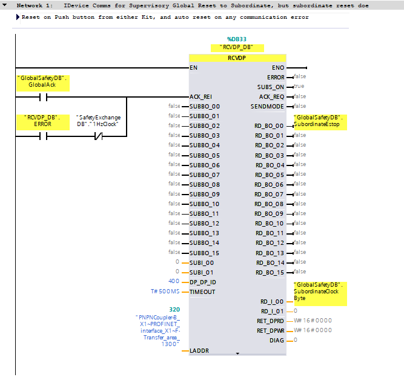
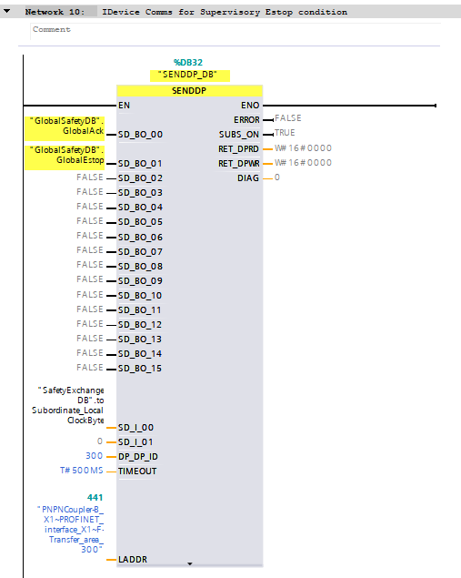
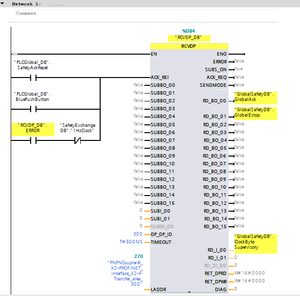
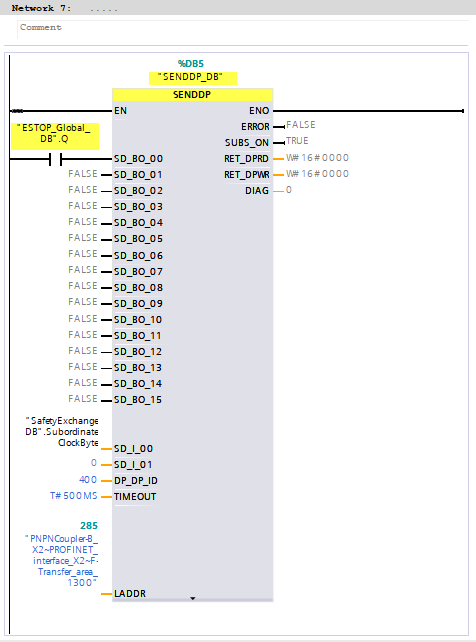

## Module 4: Failsafe Programming & Cross-System Safety

### 4.1 Learning Objectives
*   **Configure** Failsafe Inputs (F-DI) and Outputs (F-DQ) on R1/S2 stations.
*   **Implement** standard Safety Logic (E-Stop, Feedback Loop) using Siemens Safety Advanced.
*   **Establish** PROFIsafe communication across the PN/PN Coupler.
*   **Commission** PLC-C (Subordinate) for cross-system safety data exchange.

### 4.2 Reference Documents
*   `Application_Examples_and_Docs/Safety_and_Libraries/109995680_LSafe_FRedIO_V1_0_en.pdf`
*   `Application_Examples_and_Docs/Safety_and_Libraries/109826840_LSafe_VoteScale_V1_0_1_en.pdf`
*   `Application_Examples_and_Docs/Hardware_Components/pn_pn_coupler_hardware_manual_en-US_en-US.pdf`

### 4.3 Safety Hardware Configuration
Before programming, the Safety Hardware must be parameterized.

1.  **F-Destination Address (F-Dest-Add):** Each F-Module must have a unique F-Destination address assigned to it.
    *   *Pro-Tip:* These IO modules do not use physical DIP switches. The F-Destination address is assigned electronically using TIA Portal. Ensure that the address assigned in the hardware configuration is uniquely and correctly downloaded to each individual safety device.
2.  **F-Monitoring Time:** Ensure the default (150ms) is sufficient for the Redundant Switchover.
    *   *Recommendation:* Increase to **350ms or higher** for devices that might experience redundancy delays, to prevent inadvertent "Communication Faults" during CPU swap.

### 4.4 Programming E-Stop Logic
1.  **Safety Administration:** Enable "F-Capability" in the S7-1518HF Properties. Set a Safety Password.
2.  **Safety Runtime Group:** TIA Portal creates a "Main_Safety_RTG" OB (OB123). Place all safety logic here.
3.  **ESTOP1 Block:**
    *   **Call:** Call `ESTOP1` instruction from the Safety Library.
    *   **Input:** Map to the F-DI channel of the E-Stop button.
    *   **Output:** Map to the global "Safe_Enable" tag or F-DQ channels.
    *   **Ack:** Map to a standard HMI/Button reset tag for acknowledgment.

### 4.5 PN/PN Coupler Safety (F-Link)
To pass safety signals (e.g., "Global E-Stop") to the Subordinate PLC:

1.  **Transfer Area:** In the PN/PN Coupler settings, create a F-CD (F-Configuration Data) or F-MS (Module) transfer area, not just standard IO.
2.  **SENDDP / RCVDP:**
    *   **System A (Sender):** Use the `SENDDP` instruction to package safety variables into the PROFIsafe telegram.
    *   **System B (Receiver):** Use `RCVDP` to unpack them.
3.  **F_Dest_Add:** The PN/PN Coupler transfer area acts as a "Virtual F-Module". It needs a unique F-Address that must match on both sides (Sender and Receiver).

### 4.6 Commissioning the S2 PN/PN Coupler for Subordinate Safety (PLC-C)
PLC-C acts as an independent subordinate safety controller that exchanges critical safety data (such as Global E-Stops or Safety Interlocks) with the S7-1518HF system. This communication relies on configuring the PN/PN Coupler as an S2 PROFINET device to ensure uninterrupted failsafe data exchange even during a redundant switchover.

1.  **S2 Network Integration (X2 Side):**
    *   PLC-C connects to the **X2** interface of the PN/PN Coupler.
    *   In TIA Portal's Network View, explicitly multi-assign the PN/PN Coupler to both PLC-C (if acting as a redundancy partner on its end) or ensure standard S2 configuration if PLC-C is a standalone controller interacting with the redundant 1518HF.
    *   Assign the appropriate PROFINET Name and IP Address to the X2 interface in PLC-C's hardware configuration.

2.  **Failsafe Transfer Area Mirroring:**
    *   The Transfer Areas on the X2 side must be a perfect **mirror image** of the X1 side (1518HF).
    *   *Example:* If the 1518HF (X1) defines an F-MS module as "IN: 6 Bytes / OUT: 12 Bytes", PLC-C (X2) must be configured with the complementary "OUT: 6 Bytes / IN: 12 Bytes" F-MS module.
    *   **F-Destination Address Sync:** The PN/PN Coupler transfer areas act as "Virtual F-Modules". The F-Destination Address assigned to the mirrored transfer area in PLC-C *must exactly match* the F-Destination Address set in the 1518HF project for the corresponding X1 transfer area.
    *   *Pro-Tip:* Pay strict attention to the F-Monitoring time on these transfer areas. Given this is an S2 connection, the F-Monitoring Time must account for network propagation and potential redundancy switchover times (typically > 350ms).

3.  **Safety Logic Exchange (SENDDP / RCVDP):**
    *   **1518HF Perspective (Primary System):** The 1518HF acts as the primary safety controller. It uses `RCVDP` to receive the subordinate status and `SENDDP` to transmit the global safety state (e.g., Global E-Stop) to the PN/PN Coupler.

        *Example: 1518HF `RCVDP` Instruction receiving PLC-C status:*
        

        *Example: 1518HF `SENDDP` Instruction transmitting Global E-Stop to PLC-C:*
        

    *   **PLC-C Perspective (Subordinate System):** In PLC-C's `Main_Safety_RTG`, the logic is mirrored. Utilize the `RCVDP` instruction to unpack the PROFIsafe telegram sent by the 1518HF. Map these extracted signals (e.g., "Global E-Stop Active") to PLC-C's local safety logic, driving local Safe Torque Off (STO) commands. Then, use the `SENDDP` instruction to package PLC-C's local safety status (e.g., "PLC-C Zone OK") back into the outgoing transfer area for the 1518HF to read.

        *Example: PLC-C `RCVDP` Instruction receiving Global Safety state:*
        

        *Example: PLC-C `SENDDP` Instruction transmitting local status to 1518HF:*
        

4.  **Hardware Compilation & Download:**
    *   Compile the safety program and hardware configuration.
    *   Ensure PLC-C is placed into STOP mode during the initial safety hardware download, then transition back to RUN mode and verify the PN/PN Coupler establishes standard and safety communication without SF/BF faults.
